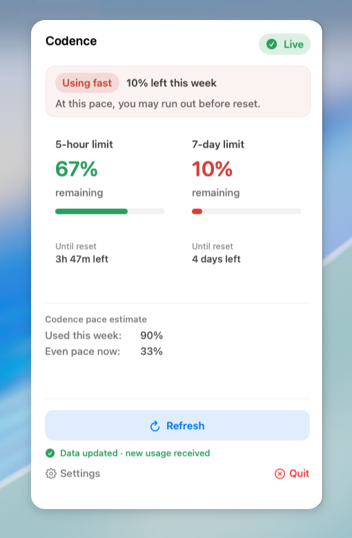
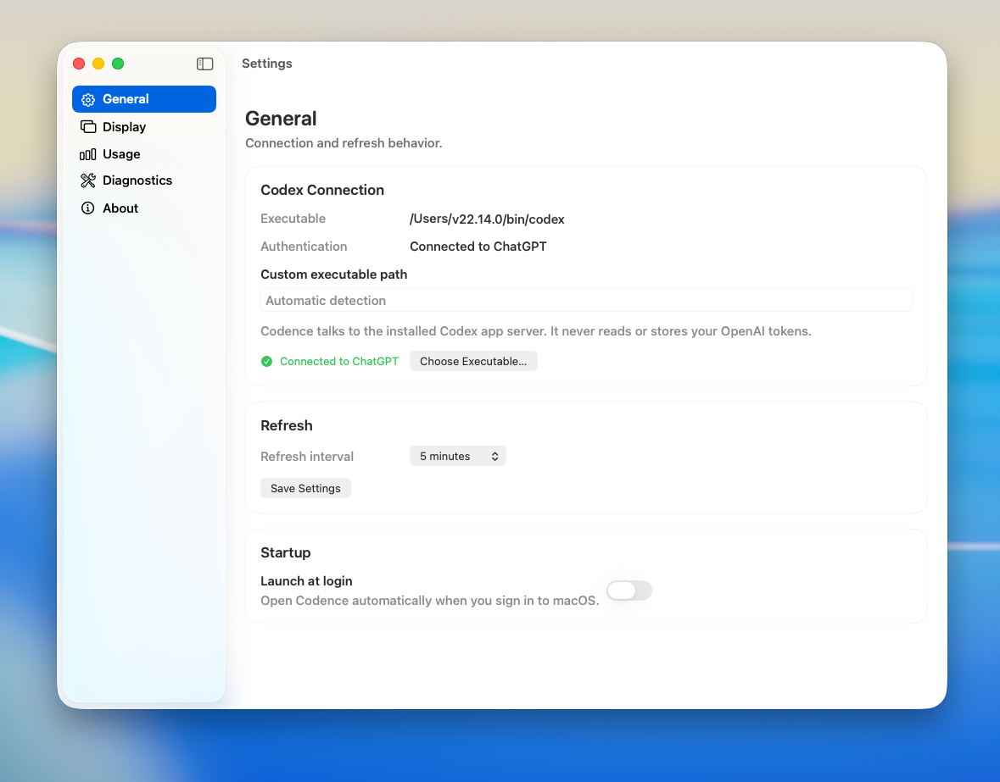

# Codence

Codence is an independent macOS menu-bar monitor for ChatGPT-backed Codex usage. It shows remaining allowance and reset countdowns for the limits reported by Codex, with clearly labeled local pace guidance. It is not an OpenAI product.

The app stays in the menu bar; it does not open a Dock window. Click its C-shaped menu-bar icon to see usage, refresh, or open Settings.

## Screenshots

*The menu-bar popover keeps usage and reset timing visible at a glance.*

*Native macOS Settings for Codex connection and app preferences.*

## Features

- Shows remaining 5-hour and 7-day allowance and reset countdowns when Codex reports those limits.
- Distinguishes live usage from saved data and labels its pace estimate as local guidance.
- Refreshes manually or automatically on a configurable interval.
- Detects the Codex executable or lets you select it, with Launch at Login and diagnostics in Settings.
- Stores settings, cached usage, history, and diagnostics locally; Codence does not read or store OpenAI credentials or send usage data to a Codence service.

## Install from source

**v0.1.0 is a source-only pre-release.** There is no downloadable `Codence.app` or DMG. Install by building a local copy with Xcode; do not redistribute that unsigned build as a public download.

Downloadable binary distribution is deferred until Apple Developer Program membership and clean-Mac acceptance are complete.

Requirements: macOS 13 or newer, the full Xcode app, and a current Codex CLI installation. [OpenAI's Codex CLI guide](https://learn.chatgpt.com/docs/codex/cli) has the current installation and sign-in instructions. Codence requires **Sign in with ChatGPT** in Codex; API-key-only authentication does not provide ChatGPT subscription quota data to this app.

1. Open the [Codence v0.1.0 release](https://github.com/Mark-in-Motion/Codence/releases/tag/v0.1.0). Under **Assets**, download **Source code (zip)**, extract it, and open Terminal in the extracted folder containing `scripts/install-local.sh`. Alternatively, developers can run `git clone https://github.com/Mark-in-Motion/Codence.git` followed by `cd Codence`.
2. Run `./scripts/install-local.sh`. It builds a Release app and installs it to `~/Applications/Codence.app` without administrator access.
3. Run `open "$HOME/Applications/Codence.app"`, then click the Codence icon in the menu bar.
4. If prompted, sign in with ChatGPT. If Codex is installed but not found, choose its executable in Settings → General.

The installer refuses to overwrite an existing `Codence.app`. For an update, quit Codence from its menu, move the old app out of `~/Applications`, and run the script again. The app's settings and cached usage data remain separate in Application Support.

To work in Xcode instead, open `Codence.xcodeproj`, select the **Codence** scheme and **My Mac**, then Run. `swift test` runs the unit tests; `swift run Codence` is a development-only alternative.

## Uninstall

1. Open the Codence menu-bar popover and choose **Quit**. If **Launch at Login** is enabled, turn it off first in Settings → General → Startup. If Codence is already gone, remove it from macOS System Settings → General → Login Items (under **Open at Login**) if it is still listed.
2. Move `~/Applications/Codence.app` to the Trash. This removes the app, **not** its saved settings or usage data.
3. Optional, for a completely clean removal: in Finder, choose Go → Go to Folder, enter `~/Library/Application Support/`, and move the **Codence** folder there to the Trash. This permanently removes Codence's local settings, cached usage, history, and diagnostics when you empty the Trash. Leave it in place if you want to retain that data for a future installation.

These steps do not uninstall the Codex CLI or change your ChatGPT account.

## Troubleshooting

- **I cannot see the app:** look for the C-shaped icon in the menu bar; macOS may hide it when the menu bar is crowded. Codence is a menu-bar-only app.
- **Codex not found:** verify `codex --version` in Terminal. For a nonstandard installation, choose the executable in Settings → General.
- **Sign in required:** use Codex's ChatGPT sign-in, then Refresh. An API-key-only Codex login does not expose this allowance.
- **Saved data instead of Live:** Codence is showing its last trusted snapshot. Open Settings → Diagnostics for the current failure and retry guidance.
- **Xcode build fails:** open the full Xcode app once to accept its license and install components, then rerun the installer. Command Line Tools alone are not enough for the Xcode project build.

See the [setup guide](docs/CODEX_SETUP_GUIDE.md) for more detail.

## Privacy and limitations

Codence launches the installed `codex app-server --stdio` locally and uses its account methods. It does not read Codex's auth file, store OpenAI credentials, scrape a web session, or send usage data to a Codence service. It stores settings, cached quota snapshots, diagnostics, and local history under `~/Library/Application Support/Codence/`.

Quota percentages come from Codex and are displayed as **remaining** allowance. Pace advice is a local estimate, not an official Codex limit or forecast. Codence is read-only: it cannot redeem credits, reset limits, or change your Codex account.

## Development and release

- [Architecture](docs/ARCHITECTURE.md)
- [Product and trust rules](docs/PRODUCT_RULES.md)
- [Release process and remaining acceptance gates](docs/RELEASE_PROCESS.md)
- [Current handoff](docs/HANDOFF.md)
- [Documentation index](docs/INDEX.md)

MIT licensed. See [LICENSE](LICENSE).
